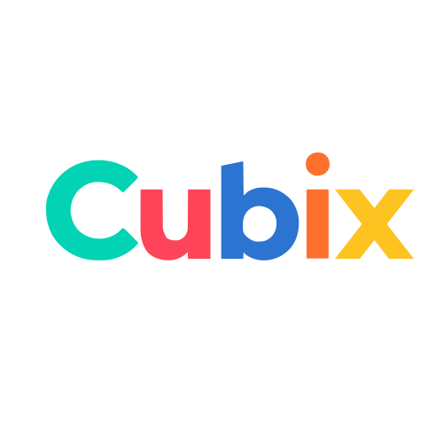
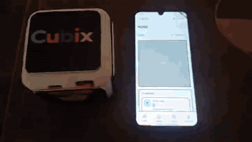
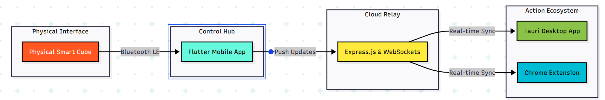

  

<h3 align="center">The Smart Cube for Intentional Focus</h3>

  

  
  
  
  
  
  
  

Cubix is a physical productivity system designed to make context-switching intentional and tangible. Instead of juggling focus modes through apps or shortcuts, users flip a **physical smart cube** to activate different productivity modes across their entire ecosystem.

---

## 🚀 The Vision

In a world full of digital distractions, Cubix brings physicality back to productivity. By moving the "mode switch" from the screen to a physical device, users create a psychological anchor for their work, study, and leisure time.

### 🎥 See it in Action

  

---

## 🛠️ The Cubix Ecosystem

The Cubix ecosystem is a multi-platform powerhouse that ensures your focus is never broken, regardless of which device you're using.

| Component | Technology | Role |
| :--- | :--- | :--- |
| **Physical Cube** | Hardware (BLE) | The tangible interface with 6 detectable orientations. |
| **Mobile App** | [Flutter](https://github.com/cubix-pack/cubix-mobile) | The control center. Reads the cube via BLE and broadcasts modes. |
| **Backend Server** | [Express.js](https://github.com/cubix-pack/cubix-backend) | The real-time relay using WebSockets to sync all devices. |
| **Desktop App** | [React + Tauri](https://github.com/cubix-pack/cubix-desktop) | Enforces system-level app blocking and provides UI feedback. |
| **Web Extension** | [Chrome Extension](https://github.com/cubix-pack/cubix-web-extenstion) | Blocks distracting websites instantly based on the current mode. |
| **Website** | [React + Vite](https://github.com/cubix-pack/cubix-website) | The informational hub and landing page for the project. |

---

## 🛠️ Technical Architecture

  

---

## 🌓 Productivity Modes

Each face of the cube corresponds to a unique mode tailored for specific tasks:

*   🔴 **Deep Work**: Maximum focus. Blocks all non-essential apps and sites.
*   🟢 **Pomodoro**: Structured 25-minute sprints with automated break reminders.
*   🟣 **Entertainment**: Curated leisure time mode. Work apps are hidden.
*   🔵 **Meetings**: Optimized for collaboration. Clears the workspace for calls.
*   ⚪ **Offline**: Zero distractions. Ultimate isolation for deep thought.
*   🟡 **Idle**: The default state. Full access to all tools.

---

## ✨ Key Features

*   **Physicality Matters**: Flipping a cube is an intentional act that signals your brain to focus.
*   **Multi-Device Sync**: Activation on the physical cube auto-syncs to your phone, desktop, and browser extension.
*   **Hardcore Blocking**: System-level restrictions that go beyond simple app-blocking.
*   **Time-Locked Tasks**: Lock the cube face for a set duration to ensure accountability.
*   **Offline Resilience**: Works even if one device is disconnected; syncs instantly upon reconnecting.

---

## 🧠 Meet the Minds

<table align="center">
  <!-- Leader Row -->
  <tr>
    <td align="center" colspan="4">
      <a href="https://github.com/bradocola">
        
         
        <b>Omar Nagy</b> (Leader)
      </a>
    </td>
  </tr>
  <!-- Team Row 1 -->
  <tr>
    <td align="center">
      <a href="https://github.com/georgeibrahim1">
        
         
        George Ibrahim
      </a>
    </td>
    <td align="center">
      <a href="https://github.com/Astronaut1984">
        
         
        George Bahij
      </a>
    </td>
    <td align="center">
      <a href="https://github.com/karimnader121">
        
         
        Karim Nader
      </a>
    </td>
    <td align="center">
      <a href="https://github.com/PierreEhab-1337">
        
         
        Pierre Ehab
      </a>
    </td>
  </tr>
  <!-- Team Row 2 -->
  <tr>
    <td align="center">
      <a href="https://github.com/adham-19">
        
         
        Adham Mansour
      </a>
    </td>
    <td align="center">
      <a href="https://github.com/AhmedEssam005">
        
         
        Ahmed Essam
      </a>
    </td>
    <td align="center">
      <a href="https://github.com/Hussein-M-H">
        
         
        Hussien Mohamed
      </a>
    </td>
    <td align="center">
      <a href="https://github.com/Matou1306">
        
         
        Mathieu Morcos
      </a>
    </td>
  </tr>
  <!-- Team Row 3 -->
  <tr>
    <td align="center" colspan="2">
      <a href="https://github.com/Hassan7Eladl">
        
         
        Hassan Eladl
      </a>
    </td>
    <td align="center" colspan="2">
      <a href="https://github.com/YoussefMaged004">
        
         
        Youssef Maged
      </a>
    </td>
  </tr>
</table>

---

  Built with ❤️ by the Cubix Team

